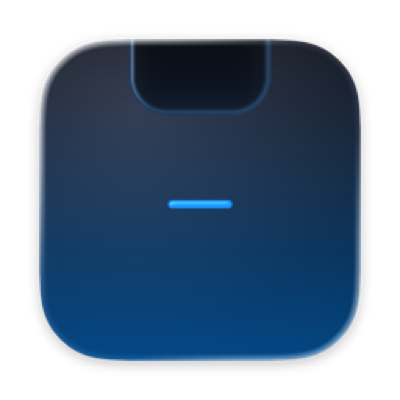

<div align="center">



# RealNotch

**A lightweight, open-source utility that turns the MacBook notch into a control center.**

Native Swift + SwiftUI. No Electron. Clipboard history, Claude Code agent monitoring, media controls, notes, and keep-awake — all living in the notch, fully skinnable.


</div>

---

## Features

Hover the notch and it grows into a tabbed panel:

- **📋 Clipboard** — history with click-to-copy, ⇧-click to stack multiple items, pin favorites, image thumbnails, and a copy confirmation animation. Password-manager entries are never recorded.
- **🖥 Agents** — live [Claude Code](https://claude.com/claude-code) sessions: which are working, which are **waiting on you**, which are done. Click to jump to the terminal. The collapsed notch shows a badge when an agent needs you. ([setup](integrations/claude-code/README.md))
- **♪ Music** — now playing from any source (Apple Music, Spotify, browsers) with artwork and transport controls. Works around Apple's macOS 15.4+ MediaRemote restriction.
- **🗒 Notes** — quick notes, pinned and persisted locally.
- **🌙 Keep Awake** — a real power assertion so your display won't sleep (same mechanism as `caffeinate`).
- **🧩 Plugins** — write your own notch panels in **Lua**. A sandboxed runtime, a tiny host API, live-reloaded from a folder. See [docs/PLUGINS.md](docs/PLUGINS.md).

Plus a slim idle state showing live glyphs (clipboard count, music waveform, agents waiting) so a glance tells you what's happening — without opening anything.

## Skins

Every color, radius, font, blur, and animation is themeable with a simple JSON file. Drop a `.json` into the themes folder and it applies **live**, no relaunch.

Ships with **11 skins** — including the developer classics **Dracula, Nord, Gruvbox, Tokyo Night, Catppuccin Mocha, Rosé Pine, and One Dark**. Build your own in minutes: see [docs/THEMES.md](docs/THEMES.md).

## Install

Grab the latest `.dmg` from [**Releases**](../../releases), open it, and drag **RealNotch** into Applications.

> **First launch:** RealNotch is open-source and unsigned (no paid Apple Developer cert), so macOS Gatekeeper will hesitate the first time. **Right-click the app → Open**, then confirm. You only do this once.

Requires **macOS 14 (Sonoma) or later**.

## Build from source

```sh
git clone https://github.com/Dshonored/realnotch.git
cd realnotch
open RealNotch.xcodeproj    # or: xcodebuild -scheme RealNotch build
```

Package a DMG yourself:

```sh
brew install create-dmg
./scripts/build-dmg.sh
```

## Roadmap

- A richer plugin host API (notes, now-playing, agents).
- Media scrubbing, global hotkey, Sparkle auto-updates.

## Contributing

PRs welcome. The project uses Xcode's filesystem-synchronized groups, so adding a file to a folder adds it to the target — no `.pbxproj` merge conflicts.

**The one rule for UI code:** no hardcoded colors, radii, or fonts in views — everything reads from `@Environment(\.theme)`. That discipline is what makes skins work.

## License

[MIT](LICENSE)
